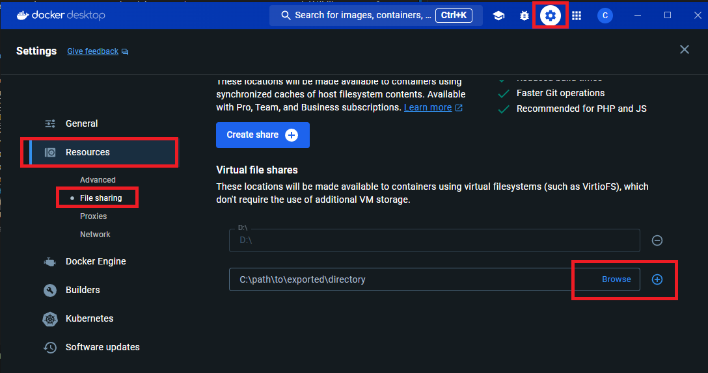
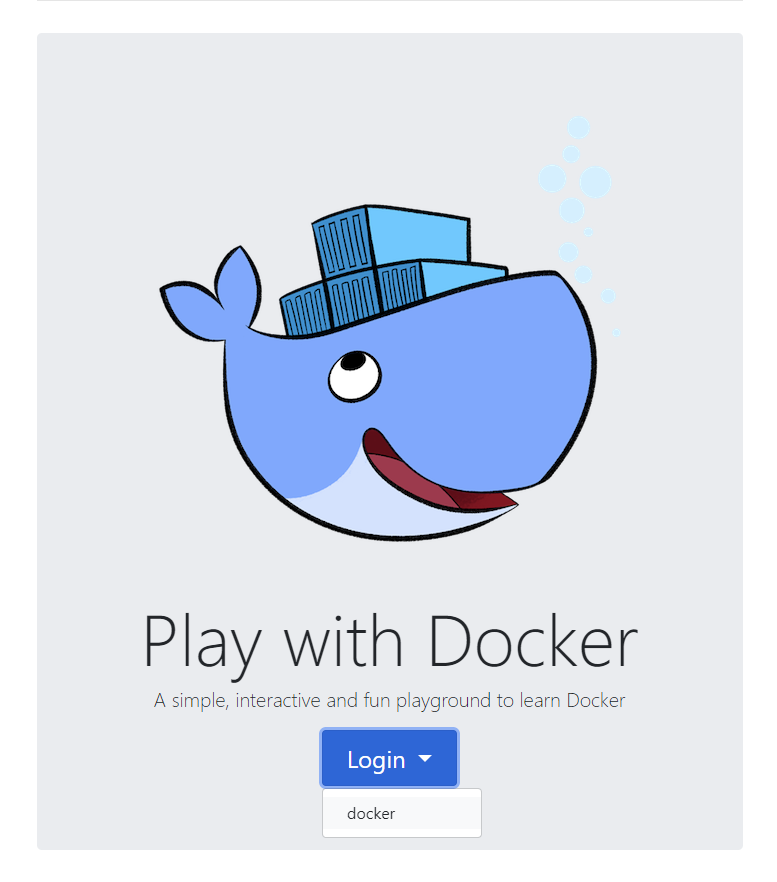

# 概要

Docker勉強会用サンプル

# 説明

- node･･･Node.jsのサンプルプログラム
- java･･･バージョン違い（JDK20と21）、ベースOS違い（corretto22）
- salesforce･･･Salesforceにおける開発環境

# コンテナ実行環境の導入手順

勉強会においては、Dockerコンテナを扱います。 
Dockerコンテナの実行環境は以下の**2つのどちらか**の手順に従って準備をお願いします。

## Docker Desktop(要インストール)

1. [Docker](https://desktop.docker.com/win/main/amd64/Docker%20Desktop%20Installer.exe?utm_source=docker&utm_medium=webreferral&utm_campaign=dd-smartbutton&utm_location=module&_gl=1*1ju5xpl*_ga*MTQyMjM0NzE1MS4xNjcxMTU3MTY1*_ga_XJWPQMJYHQ*MTcxODAyOTM5MS4xOTEuMS4xNzE4MDI5NDAyLjQ5LjAuMA..)をDLし、インストールします 
<b>インストール前のメモリの空きが2GB以上であること</b> 
<b>※Dockerを常用しない場合は、自動起動をオフにしておくことをおすすめします</b> 
1. [Windows Terminal](https://apps.microsoft.com/detail/9n0dx20hk701?rtc=1&hl=ja-jp&gl=JP)をDLし、インストールします（オプション） 
    複数のコマンドを同時に実行するときに便利
1. 当ソースのディレクトリをDockerの共有ドライブの設定に加える 
    `c:\docker-demo`を含むパスを追加 
    

## Docker プレイグラウンド(オンライン)

1. [dockr hub](https://hub.docker.com/signup)のアカウントを取得 
    既にある場合は不要
1. [docker play ground](https://labs.play-with-docker.com/)にログイン 
    

# 使い方

前提条件としてDocker Desktopをインストールしていること

## node

1. nodeディレクトリ配下に移動
1. `docker compose up -d`を実行
1. ブラウザで`localhost:3000`を実行
1. 終了時：docker compose down`を実行

## java、corretto22

1. VSCodeの[拡張機能 Remote Development](https://marketplace.visualstudio.com/items?itemName=ms-vscode-remote.vscode-remote-extensionpack)をインストール
1. `.devcontainer`フォルダがあるディレクトリに移動
1. [Shift]+[Ctrl]+[P]で「Dev Containers:Rebuild and Reopen in container」